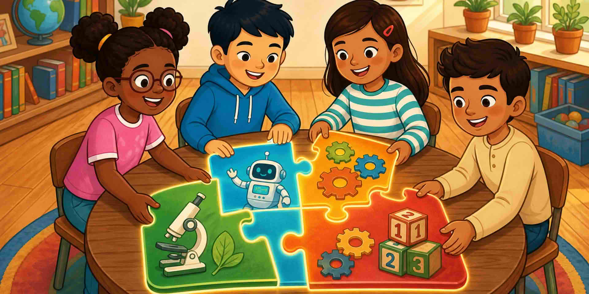

Тази първа сесия съвпада със страниците за **начинаещи читатели**. STEM е **един начин на мислене**, не тест върху четири училищни имена.

::: helper
Останете с краткото здравей. Не прескачайте към буквите преди следващия урок.
:::
