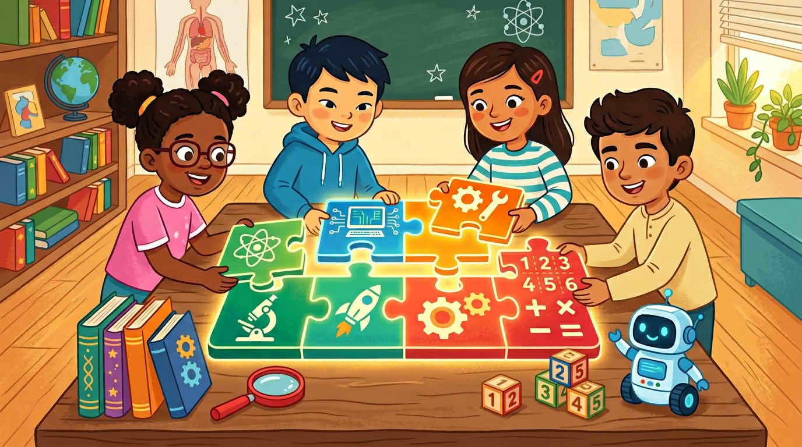

Тази първа сесия съвпада със страниците за **по-млади читатели**. Назовете курса с едно изречение и оставете четирите букви за следващия урок.

::: helper
Едно изречение за какво е курсът. Картината с пъзела на буквите е за урок две.
:::
