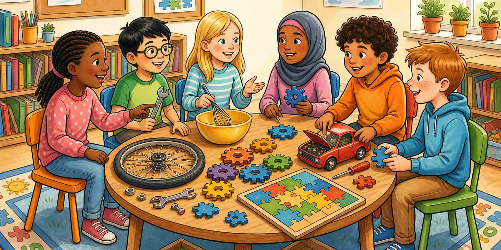

Помолете за една кратка история: учудване, правене, поправка или пъзел. Тази история е куката за следващите страници.

::: helper
Слушайте за искрата. Не превръщайте споделянето в това кой е „най-добър“ в науката.
:::
