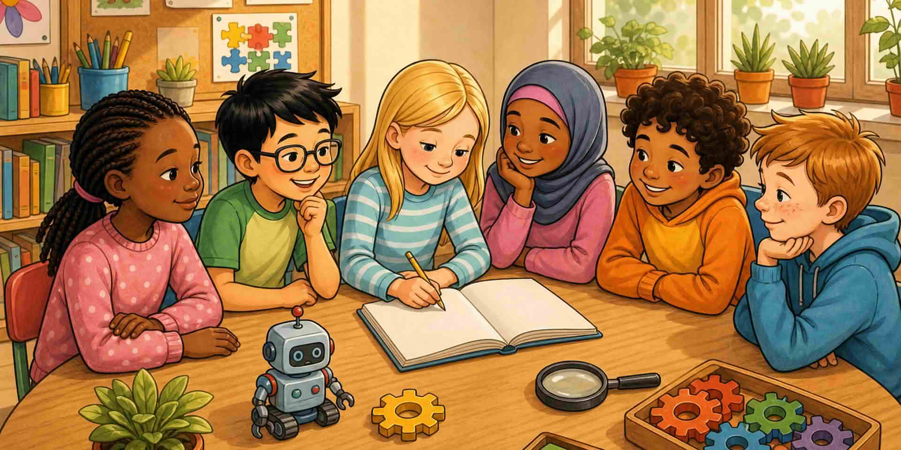

Затворете здравея: STEM е **един начин на мислене**, учудването има значение и те вече имат история, която се брои.

::: helper
По едно изречение какво искат да забележат след това. После спрете.
:::
