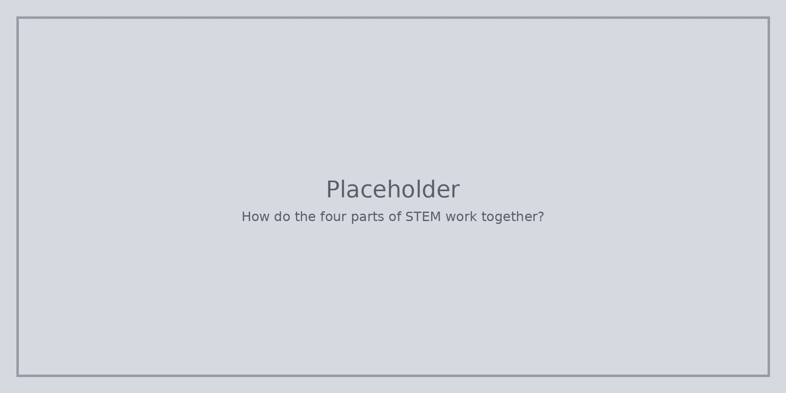

По-късните страници преизползват това наслояване. Приложение за времето, градина или стол трябва да покажат наука, инструменти, проектиране и числа върху една работа.

::: helper
Пуснете същия сценарий два пъти. Втори преглед е по-добър от десет несвързани примера.
:::
