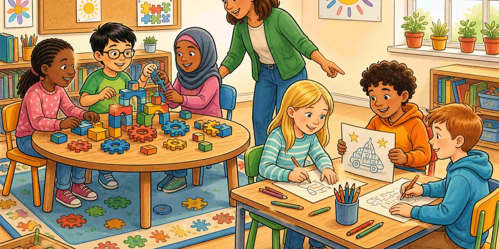

Страниците за по-млади читатели смесват решаване на проблеми, въображение и екипна работа. Кажете тези думи, докато работят, не само после.

::: helper
Ако група се втурне към един отговор, спрете ги: покажете втора идея, преди да строите.
:::
