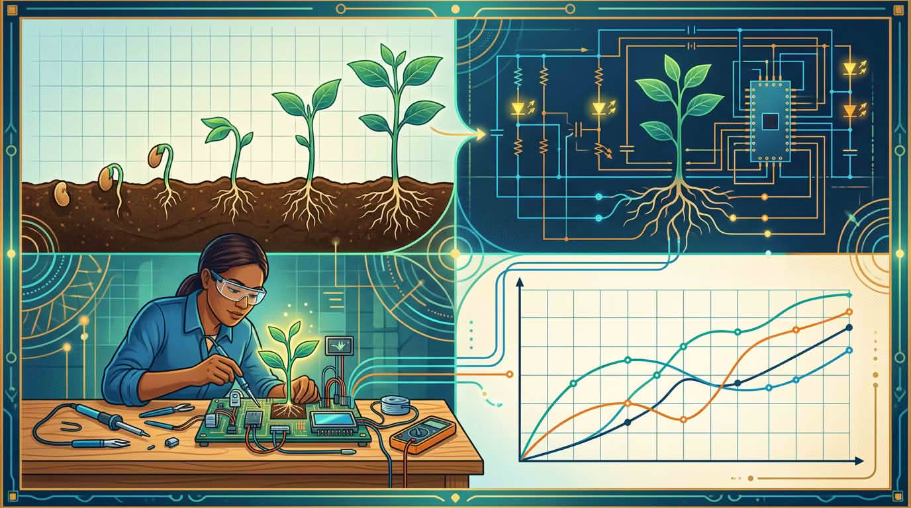

Назовете три навика в една кратка задача: разберете нещо, опитайте повече от една идея, споделете работата.

::: helper
Не разделяйте това на три минилекции. Кажете думите, когато видите поведението.
:::
