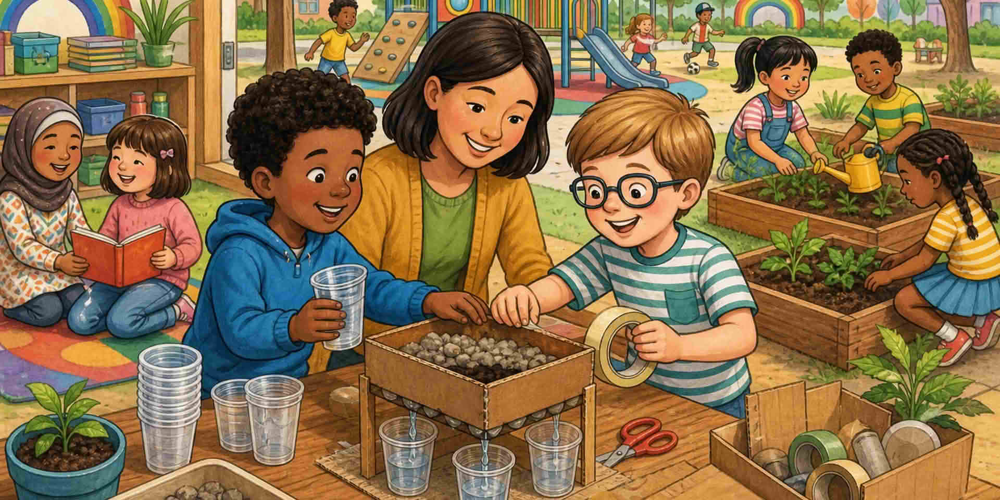

Готовността за живота и професиите могат да стоят заедно. Честните шансове принадлежат в същия дъх. Работата по двойки прави препятствията по-малко страшни.

::: helper
Не крийте ограниченията зад лозунги.
:::
