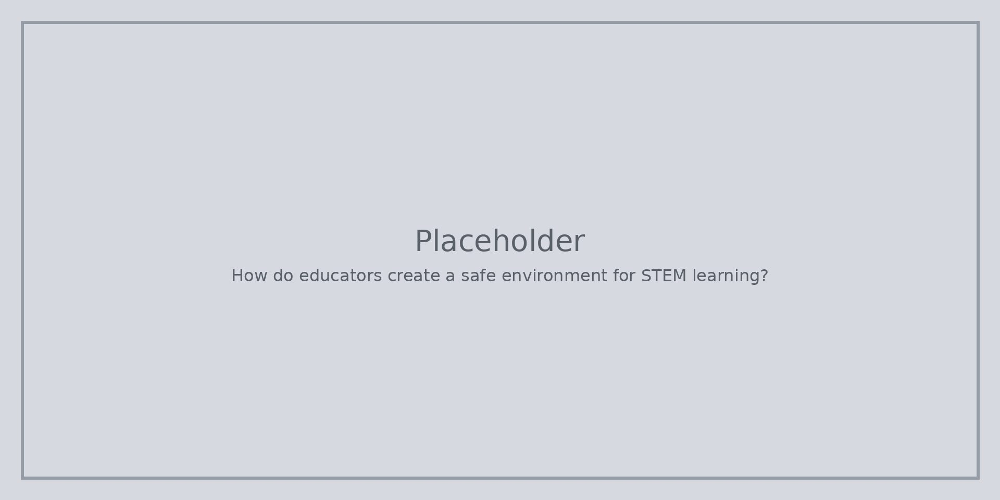

Назовете три части: надзор, без подигравки, цел, която могат да видят. Опитът и грешката умират в припряна стая.

::: helper
Отвореността не е хаос. Свободата пак се нуждае от това как работим заедно.
:::
