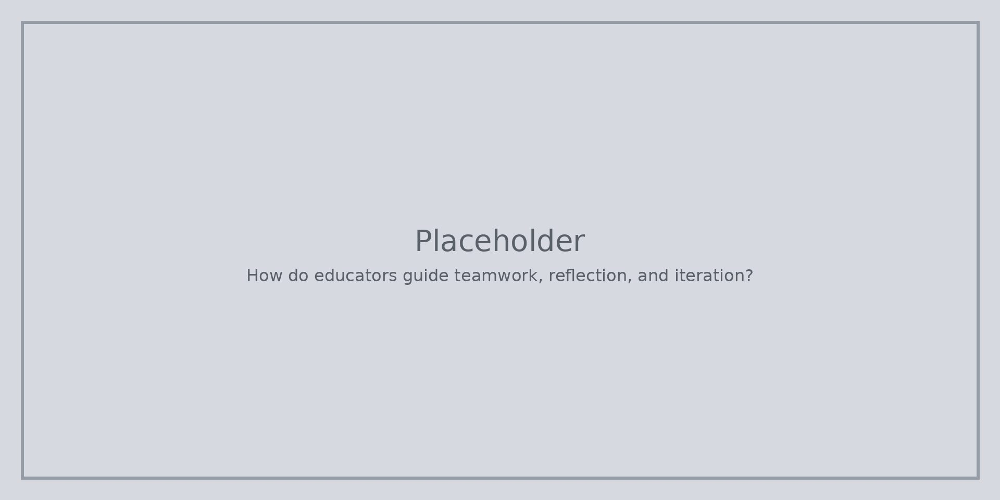

Дайте роли, когато е полезно. Попитайте какво *видяха* в опита, не какво *харесват*. Сравнете първите и по-късните опити.

::: helper
Ако група е заседнала в мнение, върнете ги към доказателствата от опита.
:::
