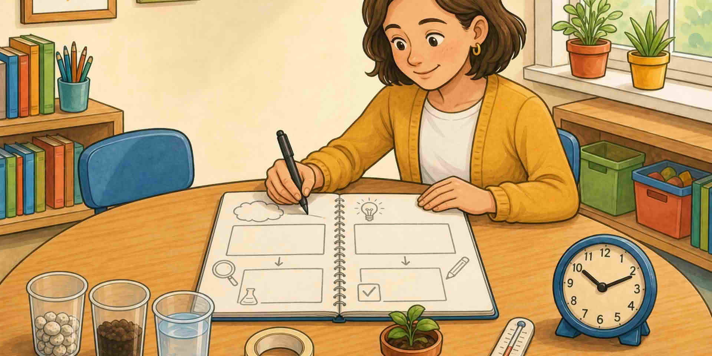

Една страница: **цел**, **въпрос**, **материали**, **време за изпитване**, **как ще кажат какво са забелязали**.

::: helper
Ако няма да се побере на една страница, заниманието е твърде голямо.
:::
