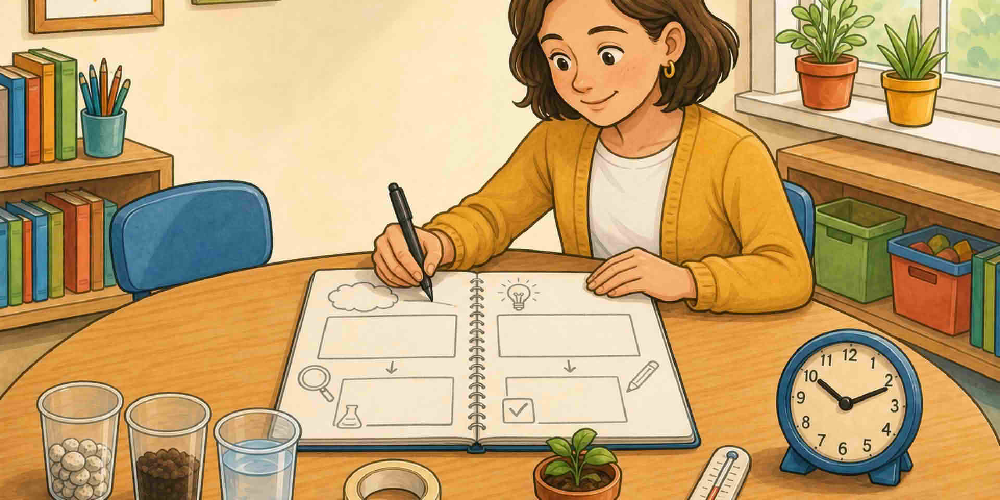

Ограниченията правят предизвикателството по-остро. Без време за подобрение ученето е тънко. Първо заглавията, украсата никога.

::: helper
Напишете заглавията, преди да добавите каквото и да е друго.
:::
