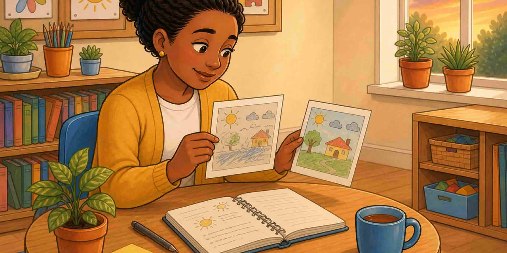

Наистина ли решаваха проблем? Имаше ли смисъл предизвикателството? Достатъчно време за преработка? Неочакваните използвания на материали са информация, не провал.

::: helper
Ако замръзнат на „кой път“, две може би, после по-малко страшното първо.
:::
