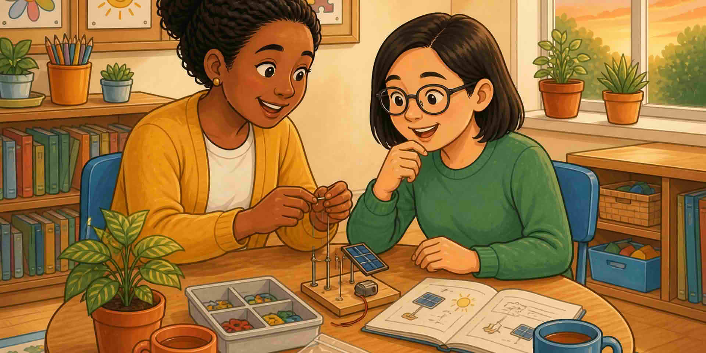

Продължавайте да растете, без да овладявате всяка STEM област. Събирайте подсказки, които работят. Приспособявайте се към стаята, която имате.

::: helper
Класна стая, клуб и кухненска маса могат да правят STEM. Копирайте навика, не един перфектен проект.
:::
